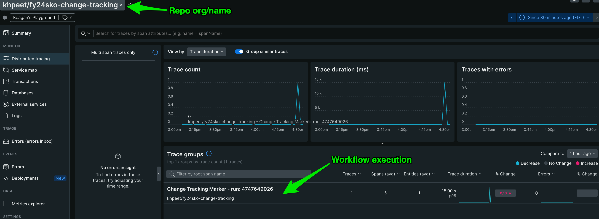
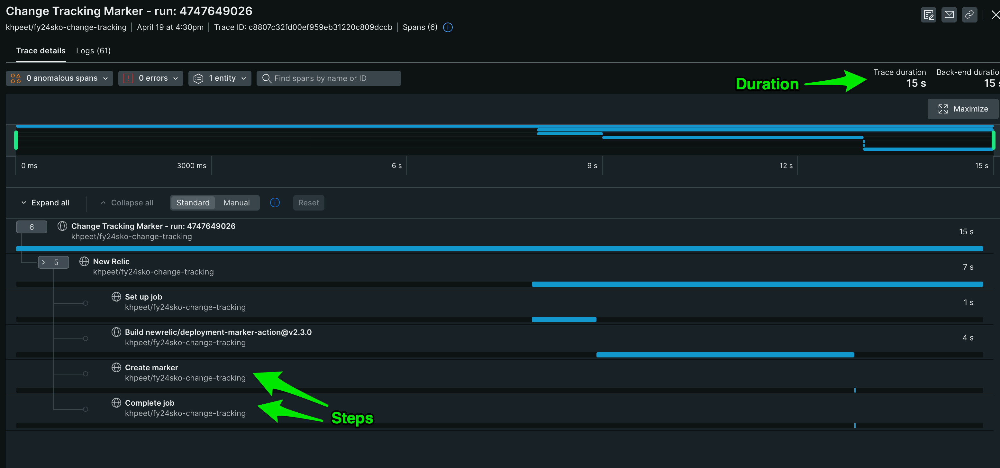
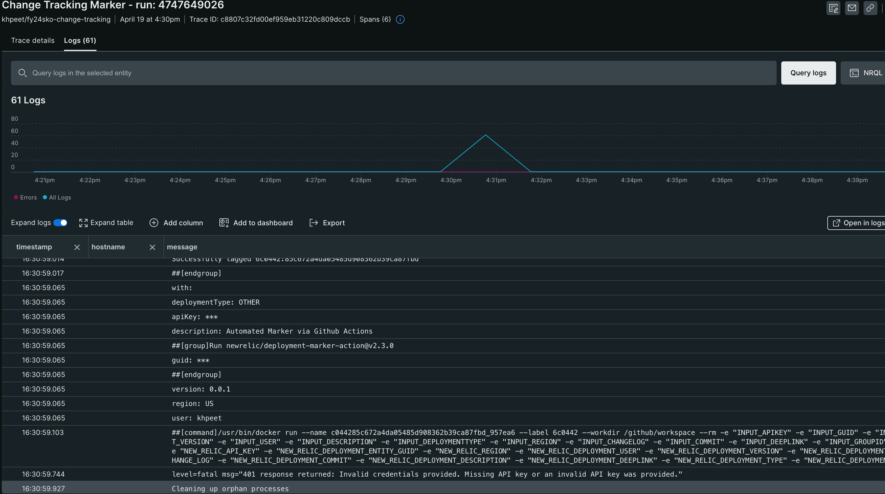

## How to monitor Github Actions with New Relic
Now, you can monitor your Github Actions with New Relic using Github Actions New Relic Exporter, making it easier to get observability into your CI/CD workflows health and performance.

You will be able to:

- Visualise key metrics on your Github Actions, such as how long your workflow/jobs/steps are taking, how often they are failing.
- Visualise workflows/jobs and steps as distributed traces with logs in context, reported to an OTEL service entity with New Relic
- Pinpoint where issues are coming from in your workflows
- Create alerts on your workflows.


## How to

Configuring the exporter

Before setting up the integration, you will need a [New Relic license/ingest API key](https://docs.newrelic.com/docs/apis/intro-apis/new-relic-api-keys/#license-key).


1. Configure your New Relic license key as a secret in your repository, and call it `NEW_RELIC_LICENSE_KEY`
2. The exporter uses automatic token authentication by default, for this you need to ensure that `GITHUB_TOKEN` has at least read access to the action scope. Alternatively, you can use a Personal Access Token, in this case, configure your PAT token as secret in your repository, called it `GHA_TOKEN`

Create your workflow yaml with below configuration, under .github/workflows, called it `new-relic-exporter.yaml` for example.

Amend env: section according to the token method in use.
`GHA_TOKEN: ${{ secrets.GITHUB_TOKEN }}` for automatic token authentication
`GHA_TOKEN: ${{ secrets.GHA_TOKEN }}` for PAT token authentication

```
name: new-relic-exporter

on:
  workflow_run:
    workflows: ['*']
    types: [completed] # defaults to run on every completed workflow run event

env:
  GHA_TOKEN: ${{ secrets.GITHUB_TOKEN }}
  NEW_RELIC_LICENSE_KEY: ${{ secrets.NEW_RELIC_LICENSE_KEY }}
  GHA_RUN_ID: ${{ github.event.workflow_run.id }}
  GHA_RUN_NAME: ${{ github.event.workflow_run.name }}
  #GHA_CUSTOM_ATTS: '{"mycustomattributea":"test", "mycustomattributeb":10, "mycustomattributec":"My custom attribute"}'
  #GHA_EXPORT_LOGS: 'false' # <---true by default

jobs:
  new-relic-exporter:
    name: new-relic-exporter
    runs-on: ubuntu-latest
    if: ${{ always() }}
    steps:
      - name: Checkout
        uses: actions/checkout@v3
      - name: new-relic-exporter
        uses: newrelic-experimental/gha-new-relic-exporter@1.0.1
```

## Example

See example repo here, using this action: https://github.com/khpeet/fy24sko-change-tracking

Traces/Logs are viewable under an OTEL service entity in New Relic, named as your repo:


Each workflow's run/execution steps can be viewed as spans, and logs are also captured, in context:



# Note on started_at fallback
If a job's `started_at` value is missing or null (e.g., for cancelled jobs), the exporter will use the `created_at` value as a fallback for both `started_at` and `started_at_ms`. This ensures queue/run time metrics are always available for all jobs.

## Troubleshooting 

- Configure `GHA_DEBUG` as secret in your repository and set it to true
- Add GHA_DEBUG: ${{ secrets.GHA_DEBUG }} to your env configuration block.

## Contributing

We encourage your contributions to improve [Github Actions New Relic Exporter](../../)! Keep in mind when you submit your pull request, you'll need to sign the CLA via the click-through using CLA-Assistant. You only have to sign the CLA one time per project. If you have any questions, or to execute our corporate CLA, required if your contribution is on behalf of a company, please drop us an email at opensource@newrelic.com.

**A note about vulnerabilities**

As noted in our [security policy](../../security/policy), New Relic is committed to the privacy and security of our customers and their data. We believe that providing coordinated disclosure by security researchers and engaging with the security community are important means to achieve our security goals.

If you believe you have found a security vulnerability in this project or any of New Relic's products or websites, we welcome and greatly appreciate you reporting it to New Relic through [HackerOne](https://hackerone.com/newrelic).

## License

Github Actions New Relic Exporter is licensed under the [Apache 2.0](http://apache.org/licenses/LICENSE-2.0.txt) License.

>Github Actions New Relic Exporter also use source code from third-party libraries. You can find full details on which libraries are used and the terms under which they are licensed in the third-party notices document.
